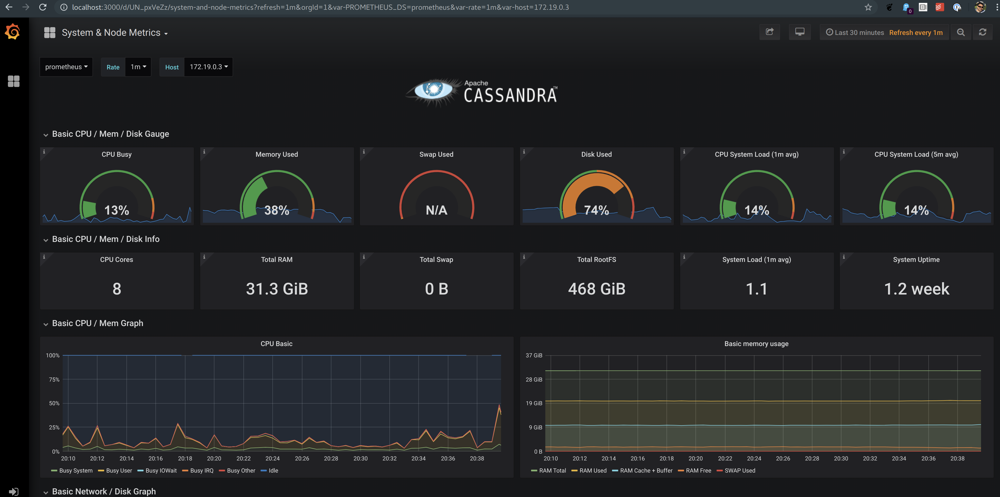
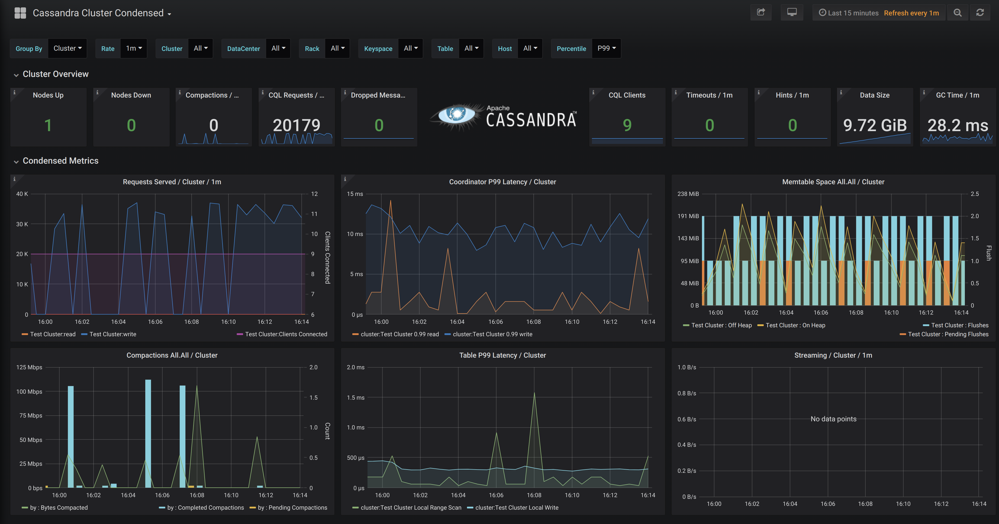

Metric Collector for Apache Cassandra&reg; (MCAC)
=================================================

Metric collection and Dashboards for Apache Cassandra (2.2, 3.0, 3.11, 4.0) clusters.


## Introduction

   Metric Collector for Apache Cassandra (MCAC) aggregates OS and C* metrics along with diagnostic events
   to facilitate problem resolution and remediation. 
   It supports existing Apache Cassandra clusters and is a self contained drop in agent.

   * Built on [collectd](https://collectd.org), a popular, well-supported, open source metric collection agent. 
   With over 90 plugins, you can tailor the solution to collect metrics most important to you and ship them to 
   wherever you need. 
   
   * Easily added to Cassandra nodes as a java agent, Apache Cassandra sends metrics and other structured events 
   to collectd over a local unix socket.  
   
   * Fast and efficient.  It can track over 100k unique metric series per node (i.e. hundreds of tables). 
     
   * Comes with extensive dashboards out of the box, built on [prometheus](http://prometheus.io) and [grafana](http://grafana.com).  
     The Cassandra dashboards let you aggregate latency accurately across all nodes, dc or rack, down to an individual table.   
     
     
     
   
## Design Principles

  * Little/No performance impact to C* 
  * Simple to install and self managed
  * Collect all OS and C* metrics by default
  * Keep historical metrics on node for analysis
  * Provide useful integration with prometheus and grafana
      
## Installation of Agent
    
 1. Download the [latest release](https://github.com/datastax/metric-collector-for-apache-cassandra/releases/latest) of the agent onto your Cassandra nodes.
 The archive is self contained so no need do anything other than `tar -zxf latest.tar.gz` 
 into any location you prefer like `/usr/local` or `/opt`.

 2. Add the following line into the `cassandra-env.sh` file:
     
     ````
     MCAC_ROOT=/path/to/directory 
     JVM_OPTS="$JVM_OPTS -javaagent:${MCAC_ROOT}/lib/cassandra-mcac-agent.jar"
     ````
 3. Bounce the node.  
 
 On restart you should see `'Starting DataStax Metric Collector for Apache Cassandra'` in the Cassandra system.log 
 and the prometheus exporter will be available on port `9103`
 
 The [config/metric-collector.yaml](config/metrics-collector.yaml) file requires no changes by default but please read and add any customizations like
 filtering of metrics you don't need. 
 
 The [config/collectd.conf.tmpl](config/collectd.conf.tmpl) file can also be edited to change default collectd plugins enabled.  But it's recommended
 you use the [include path pattern](https://collectd.org/documentation/manpages/collectd.conf.5.shtml#include_path_pattern) 
 to configure extra plugins.

## Installing the Prometheus Dashboards

 1. Download the [latest release](https://github.com/datastax/metric-collector-for-apache-cassandra/releases/latest) of the dashboards and unzip.
 
 2. Install [Docker compose](https://docs.docker.com/compose/install/)
 
 3. Add the list of C* nodes with running agents to [tg_mcac.json](dashboards/prometheus/tg_mcac.json)
  
 4. `docker-compose up` will start everything and begin collection of metrics

 5. The Grafana web ui runs on port `3000` and the prometheus web ui runs on port `9000`
     
 If you have an existing prometheus setup you will need the dashboards and [relabel config](https://prometheus.io/docs/prometheus/latest/configuration/configuration/#relabel_config) from the
 included [prometheus.yaml](dashboards/prometheus/prometheus.yaml) file.
 
 
## FAQ
  1. Where is the list of all Cassandra metrics?
  
     The full list is located on [Apache Cassandra docs](https://cassandra.apache.org/doc/latest/operating/metrics.html) site.
     The names are automatically changed from CamelCase to snake_case.
  
     In the case of prometheus the metrics are further renamed based on [relabel config](https://prometheus.io/docs/prometheus/latest/configuration/configuration/#relabel_config) which live in the 
     [prometheus.yaml](dashboards/prometheus/prometheus.yaml) file.
  
  2. How can I filter out metrics I don't care about?
     
     Please read the [metric-collector.yaml](config/metrics-collector.yaml) section on how to add filtering rules.
  
  3. What is the datalog? and what is it for?
      
     The datalog is a space limited JSON based structured log of metrics and events which are optionally kept on each node.  
     It can be useful to diagnose issues that come up with your cluster.  If you wish to use the logs yourself
     there's a [script](scripts/datalog-parser.py) included to parse these logs which can be analyzed or piped 
     into [jq](https://stedolan.github.io/jq/).
     
     Alternatively, DataStax offers free support for issues as part of our [keep calm](https://www.datastax.com/keepcalm) 
     initiative and these logs can help our support engineers help diagnose your problem.
     
  4. Will the MCAC agent work on a Mac?
     
     No. It can be made to but it's currently only supported on Linux based OS.
          
## License

Copyright DataStax, Inc.

Licensed under the Apache License, Version 2.0 (the "License"); you may not use this file except in compliance with the License. You may obtain a copy of the License at

http://www.apache.org/licenses/LICENSE-2.0

Unless required by applicable law or agreed to in writing, software distributed under the License is distributed on an "AS IS" BASIS, WITHOUT WARRANTIES OR CONDITIONS OF ANY KIND, either express or implied. See the License for the specific language governing permissions and limitations under the License.

